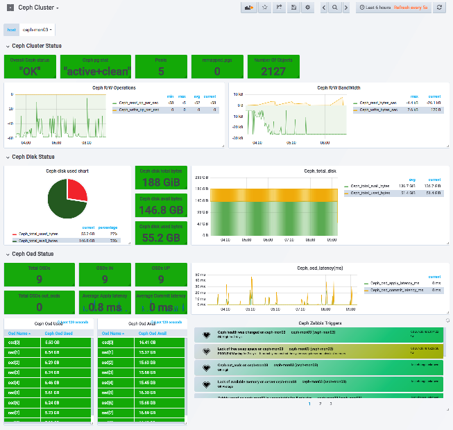

## Openstack-monitoring

Openstack-monitoring 은 kolla 6.0 기반의 컨테이너 및 베어메탈 서버의 모니터링을 위한 프로젝트이다. metric 수집 및 trigger정책은zabbix에 의하여 진행 되며, log 수집 및.aggregation 은 fluentd/filebeat ,logstash 기반으로 elasticseach 에 저장 된다.
사용자는 grafana를 통하여 zabbix, elasticsearch의 데이터를 기반으로 가시화 시켜준다.

